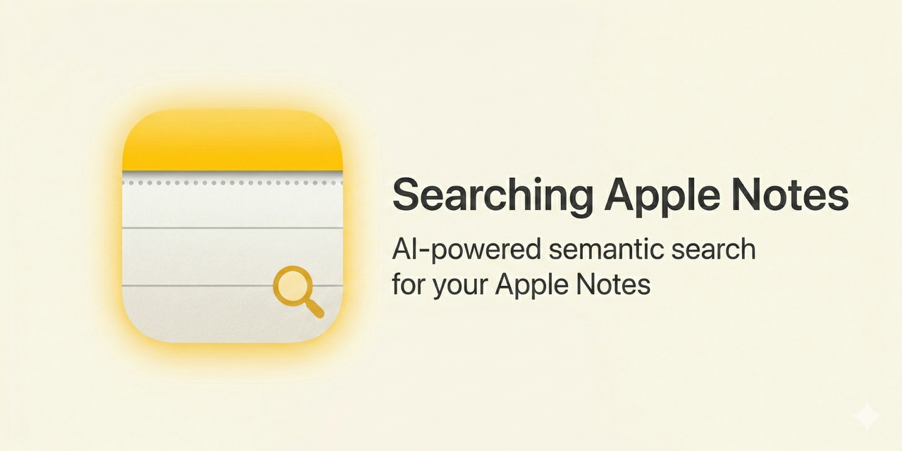

# searching-apple-notes — semantic search for Apple Notes, built for Claude Code



> Talk to Claude Code in plain English or Chinese, and it answers from your Apple Notes archive — semantically, locally, with no API keys and no MCP setup required. Drop-in skill, fully private, optimized for Chinese-English mixed content via BGE-M3.
>
> 用中文或英文跟 Claude Code 说话，它直接从你的 Apple Notes 里给你答案——语义检索、全本地、不需要 API key、不需要配置 MCP。开箱即用的技能包，完全私密，BGE-M3 原生支持中英文混合检索。

[English](#english) | [中文](#中文)

---

## English

### What is this?

`searching-apple-notes` turns your Apple Notes into a second brain that Claude Code can read and write. You ask a question in natural language, Claude semantically searches your notes (BGE-M3 embeddings + ChromaDB, all local on your Mac), reads the relevant ones, and answers with citations. You never type a search query, you never see a tool call, you never leave your conversation. When you tell Claude to capture an insight, it writes a properly formatted note back into Apple Notes — hashtags and all.

The whole thing runs on your Mac. No API keys. No third-party servers. No data leaving your machine. The only network traffic the project ever generates is the one-time download of BGE-M3 from Hugging Face during initial setup.


### Features

- **Claude Code Skill** *(recommended)*: Drop-in skill that lets Claude Code search and write your Apple Notes from any conversation, with built-in search strategy and dialogue-to-note workflow
- **Semantic Search**: Understands meaning, not just keywords
- **Chinese Optimized**: BGE-M3 embedding model handles Chinese-English mixed content natively
- **Multi-language**: Supports 100+ languages
- **Privacy First**: All data stays local — no API keys, no third-party servers
- **MCP Server** *(alternative)*: For Claude Desktop and Poke AI users who don't use Claude Code

### Two ways to use this

**1. As a Claude Code Skill — recommended.** This is the primary path. The skill teaches Claude Code *when* to search, *how* to phrase queries, *how* to interpret results, and *when* to save new insights back into Apple Notes. You install it once, then talk to Claude normally — no commands, no tool calls, no search box.

→ **[Read the skill docs and install instructions](skills/searching-apple-notes/README.md)**

**2. As an MCP server — for non-Claude-Code users.** If you use Claude Desktop, Cursor, or Poke AI on iMessage, the MCP server in `scripts/server.py` exposes the same search functionality as MCP tools. The MCP path is no longer my primary use case — I still accept PRs and bug reports, but new development happens in the Skill. See the Claude Desktop and Poke AI sections below for MCP setup.

### What it feels like to use

Once installed, the skill is invisible. You just talk to Claude in English or Chinese:

> **You:** Did I take any notes about that book on attention I read last month?
>
> **Claude:** *(silently runs `vector_search.py "attention book notes" --after 2026-03-01`)*
>
> Yes — you have a note titled "Stolen Focus, chapters 1–3" from March 14, and another titled "fragmented attention vs flow" from March 22. The first captures your reaction to the argument about social media disrupting deep reading. The second is your own elaboration where you note that flow states require a particular kind of friction-free attention that…

> **You:** 帮我找一下我写过的关于产品定位的笔记
>
> **Claude:** *(silently runs `vector_search.py "产品定位"`)*
>
> 我在你的备忘录里找到 4 条相关的笔记：…

> **You:** Save this whole conversation as a note tagged #strategy
>
> **Claude:** *(silently runs `create_note.py "Notes on attention and flow" "..." --folder "Notes"`)*
>
> Saved as a new note in your Notes folder with the #strategy tag. You'll see it in Apple Notes within a few seconds.

You never see the tool calls. You just ask, and Claude answers from your actual prior thinking — and writes new thinking back into the same archive.

### FAQ

**How does it search my notes?**
Your notes are exported to a local SQLite database, then each note is converted into a 1024-dimensional vector by the BGE-M3 embedding model. When you ask a question, your query gets embedded the same way, and ChromaDB finds the notes whose vectors are closest in meaning. This is called *semantic search* — searching for "burnout" finds notes about "exhaustion," "心累," and "running on fumes" even when none of those exact words appear in the query.

**Does it send my notes to OpenAI or any other cloud service?**
No. Everything runs on your Mac. The BGE-M3 model is downloaded once from Hugging Face during initial setup (about 2 GB), then runs entirely offline. There are no API keys, no telemetry, no third-party servers, and no usage charges. The only cloud component is the *optional* Cloudflare Worker for the Poke-AI-via-iMessage path, which most users don't need.

**Why BGE-M3 instead of OpenAI's text-embedding-3-large?**
Three reasons. (1) It's free and runs locally. (2) It's bilingual — BGE-M3 was trained heavily on Chinese and outperforms English-only embedders by a wide margin on mixed Chinese-English content. If you take notes in any language other than English, this matters. (3) Privacy — your notes never leave your Mac.

**Does it work with Chinese, Japanese, Korean, or other non-English notes?**
Yes. BGE-M3 supports 100+ languages and is particularly strong at Chinese and Chinese-English mixed content. You can ask in one language and find notes written in another.

**How is this different from Apple's built-in Notes search?**
Apple's search is keyword-based — it only finds notes that contain the exact words you typed. This skill is *semantic* — it understands that "burnout" and "exhaustion" mean the same thing, that "心流" and "flow state" are related, and that a question about "founder mental health" should match a note about "startup CEO depression." Apple's search will miss all of these.

**Do I need Claude Desktop, or does Claude Code work?**
The recommended path is **Claude Code** with the Skill. Claude Desktop works via the MCP server but the MCP path is no longer the primary use case — see the "Two ways to use this" section above.

**How do I keep the index in sync as I add new notes?**
The skill includes a `sync_index.py` helper that re-exports from Notes.app and incrementally updates the vector index. Only notes modified since the last sync get re-embedded, so it usually finishes in seconds. You can run it manually, schedule it via launchd, or just tell Claude "refresh my notes index" and it will run it for you.

**What about Notion, Evernote, Obsidian, or other note apps?**
Currently Apple Notes only. The export pipeline depends on AppleScript, which is Apple Notes specific. PRs for other backends are welcome — the search and skill layers are app-agnostic.

**Is it really free?**
Yes. Free, MIT licensed, no API charges, no subscription. The only cost is disk space (about 2 GB for the BGE-M3 model and another ~50 MB per 1000 notes for the vector index).

### Quick Start

**Requirements:**
- macOS
- Python 3.10+
- Basic terminal knowledge (or ask AI like Claude to help!)

**Installation (5 minutes):**

```bash
# Clone the repo
git clone https://github.com/yinanli1917-cloud/searching-apple-notes.git
cd searching-apple-notes

# Install dependencies
pip3 install -r requirements.txt

# Export your notes
cd scripts && python3 export_notes_fixed.py

# Build search index (takes 3-5 minutes first time)
python3 indexer.py
```

**Use with Claude Desktop:**

1. Edit Claude's config file:
   ```bash
   open ~/Library/Application\ Support/Claude/claude_desktop_config.json
   ```

2. Add this configuration (update the path):
   ```json
   {
     "mcpServers": {
       "apple-notes": {
         "command": "python3",
         "args": ["/Users/YOUR_USERNAME/searching-apple-notes/scripts/server.py"]
       }
     }
   }
   ```

3. Restart Claude Desktop

4. Try searching: `Search for "funny content" in my notes`

👉 [Learn more about configuring MCP servers](https://modelcontextprotocol.io/quickstart/user)

**Use with Poke AI (iMessage):**

Search your notes directly from iMessage using Poke AI!

1. Install [Poke AI](https://poke.com) on your iPhone
2. Start the services on your Mac:
   ```bash
   cd ~/searching-apple-notes/scripts
   ./start_poke_services.sh
   ```
3. Configure Poke AI with the MCP server URL:
   ```
   https://apple-notes-mcp.yinanli1917.workers.dev/sse
   ```
4. Search via iMessage: "Search my notes for funny jokes"

👉 [Full Poke AI Setup Guide](docs/POKE_INTEGRATION.md)

### Cost

**Local (Free):**
- All data stays on your Mac
- Complete privacy
- No internet required (except downloading models)

**Cloud Deploy (Optional):**
- Cloudflare: Free plan is enough
- Fly.io: ~$2-3/month
- Railway: ~$5/month
- Access from anywhere with your phone

### Tech Stack

**Core Search:**
- **BGE-M3**: Chinese-optimized embedding model (1024-dim)
- **ChromaDB**: Vector database
- **Python 3.12**

**Integrations:**
- **FastMCP**: MCP protocol framework (Claude Desktop)
- **Cloudflare Workers**: Serverless platform (Poke AI)
- **Cloudflare Tunnel**: Secure local-to-cloud bridge

### Documentation

- [Poke AI Integration Guide](docs/POKE_INTEGRATION.md) - Search via iMessage
- [Auto-Sync Guide](docs/AUTO_SYNC.md) - Keep your index up-to-date automatically
- [Cloudflare Tunnel Setup](docs/CLOUDFLARE_TUNNEL.md) - Local-to-cloud bridge
- [Cloud Deployment Guide](docs/DEPLOY.md) - Deploy to Fly.io/Railway
- [Project Status](STATUS.md) - Current features and roadmap
- [Technical Details](docs/PROJECT_LOG.md) - Development log

### Contributing

Contributions welcome! Feel free to:
- Report bugs
- Suggest features
- Improve documentation
- Submit pull requests

### License

MIT License © 2025 [Yinan Li](https://github.com/yinanli1917-cloud)

**Made with ❤️ by [Yinan Li](https://github.com/yinanli1917-cloud) & [Claude Code](https://claude.ai/claude-code)**

---

## 中文

### 这是什么？

`searching-apple-notes` 把你的苹果备忘录变成 Claude Code 可以读写的第二大脑。你用自然语言问问题，Claude 在本地对你的笔记做语义检索（BGE-M3 嵌入模型 + ChromaDB，全部跑在你的 Mac 上），读出相关的笔记，然后带着引用回答你。你不用敲搜索关键词，不用看到任何工具调用，不用离开对话。当你让 Claude 把某个洞察存下来时，它会用合适的格式把笔记写回 Apple Notes——hashtag 都帮你打好。

全部在本地跑。不需要 API key，不依赖任何第三方服务器，你的数据从不离开你的电脑。整个项目只产生一次网络流量：初次安装时从 Hugging Face 下载 BGE-M3 模型。


### 特性

- **Claude Code 技能包** *（推荐）*：开箱即用的技能包，让 Claude Code 在任何对话中都能搜索和写入你的 Apple Notes，内置搜索策略和"对话→笔记"工作流
- **语义搜索**：理解含义，而不仅仅是关键词匹配
- **中文优化**：BGE-M3 嵌入模型原生支持中英文混合内容
- **多语言支持**：支持 100+ 种语言
- **隐私优先**：数据全部保存在本地——不需要 API key，不依赖任何第三方服务器
- **MCP 服务器** *（备选）*：给那些不用 Claude Code、而是用 Claude Desktop 或 Poke AI 的用户

### 两种使用方式

**1. 作为 Claude Code 技能包——推荐方案。** 这是主要的使用路径。技能包教 Claude Code **什么时候**该搜、**怎么**写查询、**怎么**理解返回结果、**什么时候**该把新洞察写回 Apple Notes。装一次，之后就正常跟 Claude 对话——不用命令，不用工具调用，不用搜索框。

→ **[查看技能包文档和安装说明](skills/searching-apple-notes/README.md)**

**2. 作为 MCP 服务器——给不用 Claude Code 的用户。** 如果你用的是 Claude Desktop、Cursor 或者 iMessage 上的 Poke AI，`scripts/server.py` 里的 MCP 服务器把同样的搜索功能暴露成 MCP 工具。MCP 这条路径已经不是我目前的主要使用场景——我仍然接受 PR 和 bug 报告，但新功能开发都在技能包那边进行。MCP 的配置见下面的 Claude Desktop 和 Poke AI 章节。

### 用起来是什么感觉

安装好之后，技能包是隐形的。你就用中文或英文跟 Claude 说话：

> **你：** 我上个月写过关于注意力的那本书的笔记吗？
>
> **Claude：** *(在后台调用 `vector_search.py "注意力 书 笔记" --after 2026-03-01`)*
>
> 有的——你 3 月 14 日有一篇笔记叫《Stolen Focus 第 1-3 章》，3 月 22 日还有一篇叫《碎片化注意力 vs 心流》。第一篇记录了你对作者关于社交媒体破坏深度阅读这个论点的反应；第二篇是你自己的延伸思考……

> **你：** Help me find notes about product positioning
>
> **Claude：** *(在后台调用 `vector_search.py "product positioning"`)*
>
> Found 4 relevant notes in your archive: …

> **你：** 把刚才整段对话存成笔记，打 #strategy 标签
>
> **Claude：** *(在后台调用 `create_note.py "关于注意力与心流的对话" "..." --folder "Notes"`)*
>
> 已经存到你的 Notes 文件夹里，加了 #strategy 标签。几秒内会在 Apple Notes 里看到。

你看不到工具调用。你只是问问题，Claude 用你过去真实的思考来回答——同时把新的思考写回同一个备忘录库。

### 常见问题

**它是怎么搜我的笔记的？**
你的笔记会被导出到一个本地的 SQLite 数据库，然后每条笔记被 BGE-M3 嵌入模型转换成 1024 维的向量。当你问问题时，你的查询也会被同样地转成向量，ChromaDB 找出意义最接近的笔记。这叫*语义搜索*——搜"职业倦怠"能找到写"心累"、"exhaustion"、"再也撑不住"的笔记，哪怕这些字一个都没出现过。

**它会把我的笔记发送给 OpenAI 或者任何云服务吗？**
不会。一切都在你的 Mac 上跑。BGE-M3 模型只在初次安装时从 Hugging Face 下载一次（约 2 GB），之后完全离线运行。不需要 API key，没有埋点上报，没有第三方服务器，没有任何使用费。唯一的云端组件是*可选的* Cloudflare Worker（用于 Poke AI iMessage 路径），大多数用户不需要。

**为什么用 BGE-M3 而不是 OpenAI 的 text-embedding-3-large？**
三个原因。（1）免费且本地运行。（2）它是双语的——BGE-M3 在中文上训练得很重，对中英文混合内容的表现远超纯英文嵌入模型。如果你用中文记笔记，这一点很重要。（3）隐私——你的笔记永远不离开你的 Mac。

**支持中文、日文、韩文或者其他非英文笔记吗？**
支持。BGE-M3 支持 100+ 种语言，对中文和中英文混合特别强。你可以用一种语言问，找到用另一种语言写的笔记。

**它和 Apple 自带的 Notes 搜索有什么区别？**
Apple 的搜索是关键词匹配——只能找到包含你输入的精确词的笔记。这个技能是*语义的*——它理解"职业倦怠"和"心累"是一回事，"心流"和"flow state"是相关的，"创业者心理健康"应该匹配到"startup CEO depression"。Apple 自带搜索全部都会漏掉。

**我需要 Claude Desktop 吗？还是 Claude Code 也可以？**
推荐方案是 **Claude Code + 技能包**。Claude Desktop 通过 MCP 服务器也能用，但 MCP 路径不再是主要使用场景——见上面的"两种使用方式"章节。

**我新加了笔记，索引怎么保持更新？**
技能包里有个 `sync_index.py` 帮助脚本，会重新从 Notes.app 导出并增量更新向量索引。只有自上次同步以来修改过的笔记会被重新嵌入，通常几秒钟就能跑完。你可以手动运行，也可以用 launchd 定时跑，或者直接告诉 Claude "刷新一下我的笔记索引"，它会帮你跑。

**那 Notion、Evernote、Obsidian 这些呢？**
目前只支持 Apple Notes。导出流水线依赖 AppleScript，是 Apple Notes 特定的。欢迎为其他后端提 PR——搜索层和技能层与具体笔记应用无关。

**真的免费吗？**
真的。免费、MIT 协议、没有 API 费用、没有订阅。唯一的开销是磁盘空间（BGE-M3 模型约 2 GB，向量索引每 1000 条笔记约 50 MB）。

### 快速开始

**前置要求：**
- macOS 电脑
- Python 3.10+
- 基础的终端使用（或者让 AI 比如 Claude 帮你！）

**安装步骤（5 分钟）：**

```bash
# 克隆项目
git clone https://github.com/yinanli1917-cloud/searching-apple-notes.git
cd searching-apple-notes

# 安装依赖
pip3 install -r requirements.txt

# 导出备忘录
cd scripts && python3 export_notes_fixed.py

# 建立搜索索引（首次需要 3-5 分钟）
python3 indexer.py
```

**在 Claude Desktop 中使用：**

1. 编辑 Claude 配置文件：
   ```bash
   open ~/Library/Application\ Support/Claude/claude_desktop_config.json
   ```

2. 添加以下配置（修改路径为你的实际路径）：
   ```json
   {
     "mcpServers": {
       "apple-notes": {
         "command": "python3",
         "args": ["/Users/你的用户名/searching-apple-notes/scripts/server.py"]
       }
     }
   }
   ```

3. 重启 Claude Desktop

4. 试试搜索：`搜索我笔记里的"幽默搞笑"内容`

👉 [了解更多关于配置 MCP 服务器](https://modelcontextprotocol.io/quickstart/user)

**在 Poke AI（iMessage）中使用：**

直接通过 iMessage 搜索你的备忘录！

1. 在 iPhone 上安装 [Poke AI](https://poke.com)
2. 在 Mac 上启动服务：
   ```bash
   cd ~/searching-apple-notes/scripts
   ./start_poke_services.sh
   ```
3. 在 Poke AI 中配置 MCP 服务器 URL：
   ```
   https://apple-notes-mcp.yinanli1917.workers.dev/sse
   ```
4. 通过 iMessage 搜索："搜索我的笔记里关于幽默搞笑的内容"

👉 [完整 Poke AI 配置指南](docs/POKE_INTEGRATION.md)

### 费用

**本地使用（免费）：**
- 所有数据保存在你的 Mac 上
- 完全隐私保护
- 无需联网（除了下载模型）

**云端部署（可选）：**
- Cloudflare: 免费版已经足够消费者使用了
- Fly.io：约 $2-3/月
- Railway：约 $5/月
- 可以在任何地方用手机访问

### 技术栈

**核心搜索：**
- **BGE-M3**：中文优化的嵌入模型（1024 维向量）
- **ChromaDB**：向量数据库
- **Python 3.12**

**集成方式：**
- **FastMCP**：MCP 协议框架（Claude Desktop）
- **Cloudflare Workers**：无服务器平台（Poke AI）
- **Cloudflare Tunnel**：安全的本地到云端桥接

### 文档

- [Poke AI 集成指南](docs/POKE_INTEGRATION.md) - 通过 iMessage 搜索
- [自动同步指南](docs/AUTO_SYNC.md) - 自动保持索引最新
- [Cloudflare Tunnel 配置](docs/CLOUDFLARE_TUNNEL.md) - 本地到云端桥接
- [云端部署指南](docs/DEPLOY.md) - 部署到 Fly.io/Railway
- [项目状态](STATUS.md) - 当前功能和路线图
- [技术文档](docs/PROJECT_LOG.md) - 开发日志

### 参与贡献

欢迎贡献！你可以：
- 报告 Bug
- 提出功能建议
- 改进文档
- 提交 Pull Request

### 常见问题

**Q: 我不会用命令行怎么办？**

A: 可以让 AI 助手（比如 Claude、ChatGPT）帮你！复制命令给它们，让它们一步步指导你。

**Q: 支持其他笔记应用吗？**

A: 目前只支持 Apple Notes。Notion、Evernote 等可以先导出成文本后使用。

**Q: 能在手机上用吗？**

A: 当然可以！任何支持MCP的AI都可以✨

### 致谢

**灵感来源**：[ima (腾讯出品)](https://ima.qq.com/download?webFrom=10000075) - 优秀的 在线RAG个人知识库 应用

**使用的开源项目**：
- [FastMCP](https://github.com/jlowin/fastmcp)
- [BGE-M3](https://github.com/FlagOpen/FlagEmbedding)
- [ChromaDB](https://www.trychroma.com/)

### 开源协议

MIT License © 2025 [Yinan Li](https://github.com/yinanli1917-cloud)

**Made with ❤️ by [Yinan Li](https://github.com/yinanli1917-cloud) & [Claude Code](https://claude.ai/claude-code)**

如果觉得有用，请给我们一个 ⭐！
